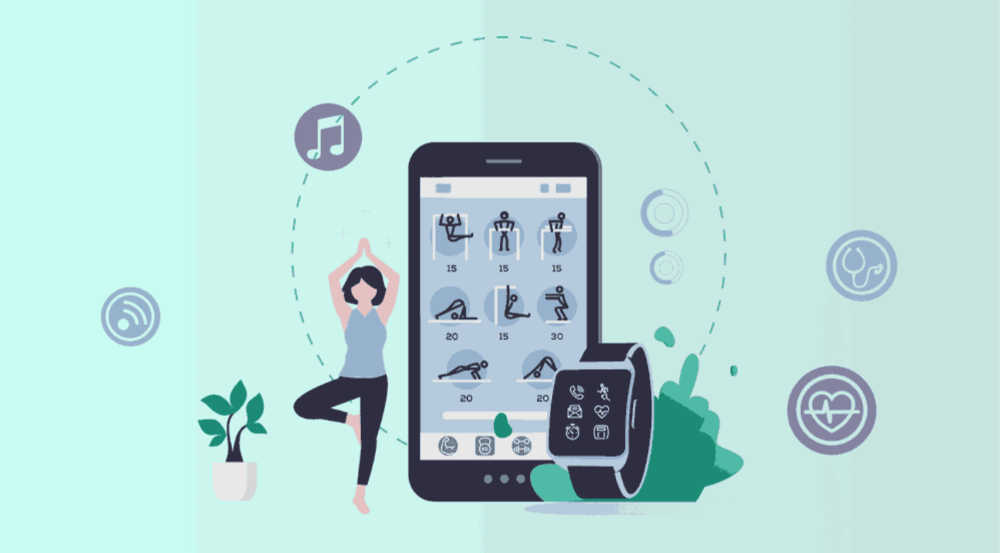

# HackerCamp'22

## At Home Fitness & Wellness App

# [Demo Link](https://youtu.be/-G7kfjzN5G4)

Prototype of an interactive health and fitness app that would nudge users to live a healthy lifestyle

The aim is to develop a holistic environment for fitness both mental & physical starting with the following capabilities -  
1. Pedometer with Calorie Counter
2. Pose Estimation(Computer Vision) based exercise Rep Counter
3. Pose Estimation(Computer Vision) based exercise Posture Corrector
4. Self-Scheduled sessions
5. Wearable and non-wearable device integration
6. Activity summaries by specific time period
7. Goal setting
8. Tracking metrics
9. Push notifications
10. Social sharing
11. Diet Recommendation

  
   
  
   

  
   
  
  

